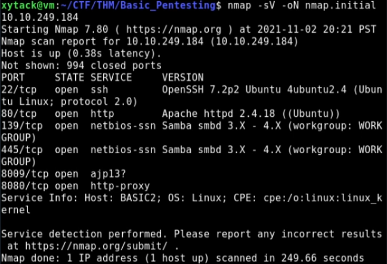
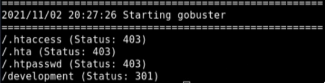
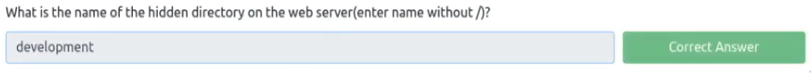
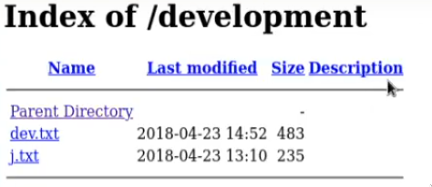
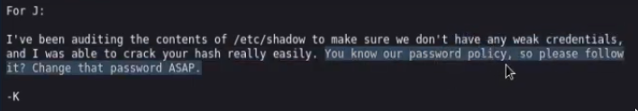
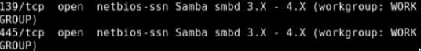
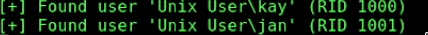

# [THM] BASIC PENTESTING (not done yet)

First, I did the usual scanning with nmap, nikto, and gobuster (dir) on the address.

```bash
nmap -sV -oN nmap.initial <address>
```


```bash
gobuster -u http://<address>/ -w common.txt
```


Looks like they have a "/development" directory and I answered the first question with it!



Moving on, the development endpoint gave us access to the dev notes. 




The dev.txt file did have something interesting in it, but it gave me the false clues that will waste a lot of my energy during the stream.

The j.txt on the other hand 



Based on the message, it looks like I will use the password cracker "john" for later.

After that I set on an adventure on the obfuscated part of the Try Hack Me room and wasted a lot of energy and time. I finally got over the apache and struts clues from the dev.txt file. 

So I took a good look at the nmap output once more and saw that the samba service is available. Which means that we can enumerate usernames with it. 



I came across a tool called "Enum4Linux" and it game me more problems due to old development packages and stuff.

I eventually made it work and tried to figure out how to actually use it to enumerate usernames. It took some time and even tried other solutions and tools but I found the usernames with the command: 
```
enum4linux.py -A -R <address>
```



30:58


