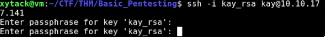
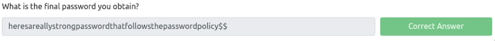

# [THM] BASIC PENTESTING (not done yet)

First, I did the usual scanning with nmap, nikto, and gobuster (dir) on the address.

```bash
nmap -sV -oN nmap.initial <address>
```


```bash
gobuster -u http://<address>/ -w common.txt
```


Looks like they have a "/development" directory and I answered the first question with it!


Moving on, the development endpoint gave us access to the dev notes. 


The dev.txt file did have something interesting in it, but it gave me the false clues that will waste a lot of my energy during the stream.

The j.txt on the other hand 


Based on the message, it looks like I will use the password cracker "john" for later.

After that I set on an adventure on the obfuscated part of the Try Hack Me room and wasted a lot of energy and time. I finally got over the apache and struts clues from the dev.txt file. 

So I took a good look at the nmap output once more and saw that the samba service is available. Which means that we can enumerate usernames with it. 


I came across a tool called "Enum4Linux" and it game me more problems due to old development packages and stuff.

I eventually made it work and tried to figure out how to actually use it to enumerate usernames. It took some time and even tried other solutions and tools but I found the usernames with the command: 
```
enum4linux.py -A -R <address>
```


Now I have our answer! The other username is "kay" BTW.


For jan's password, I used "hydra" to brutefoce the ssh with the rockyou.txt wordlist.

```
hydra -l jan -P rockyou.txt ssh://<address>
```


there goes the password, and I also answered the next question with "SSH". Now that we have the password, we can now get in to a shell:


Then lastly, we will have to get Kay's password. 

I tried to browse the common directories first for clues and found a private id_rsa file on kay's .ssh dir with reading permsions for all users. 


So I copied it and tried to connect to the shell with it. Sadly, It prompt me for a passphrase for the key.



I don't like using tools made by other people without know what it does, but the room made me do it Script Kiddie FTW. So I decided to use linpeas.

So I downloaded linpeas and sent the file using wget "--post-file" on my local computer, then executing it in the target system with netcat piped to sh:
```
nc -lnvp 9001 | sh
```

As expected, I did not understood all of the output linepeas is giving me. I wasted a lot more time fiddling with linpeas only to find out I was wasting more time.

At this rate I resorted on watching JohnHammond's video on solving this room. I was surprised we both used linpeas in this. What JH saw in the linpeas was the readable private id_rsa file which I already found before using linpeas. What's new is that that we can crack the passhrase of that private rsa file with the "john" tool. 
I stopped watching JH's video and proceed to researching about how to actually do it.


There is no shame to rely on writeups when you are stuck as long as you are learning. 

I needed to turn the rsa file to a hash which john can read with ssh2john.py then tried to crack it and failed. It says no hash even though I already converted it.


I was surprised and mad when it didn't work. I watched John Hammond's video again and he did the same thing I did but his got through and I accidentally saw the password.

But I did not give up. I wanted get the password on my own. So I researched more about john and found out that there is another version of john which can read hashes from ssh2john.py called john (Jumbo)

I installed the Jumbo version using snap and tried the command once more:


And now I was presented with the password "beeswax"

we can now login as kay and cat the pass.bak file in kay's home directory and finish the room.




DONE!