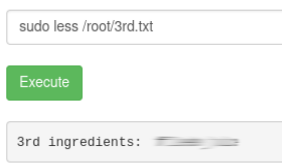

# [THM] Pickle Rick writeup

ps: I didn't got to screenshot the actual procedure because I'm dum. But I made notes! check [files](files/notes.md)

## Scanning and Enumeration

I scanned the IP ADDRESS using Nmap, Gobuster, and Nitko

```
NMAP SCAN

===Initial===

Starting Nmap 7.80 ( https://nmap.org ) at 2021-10-27 20:40 PST
PORT   STATE SERVICE VERSION
22/tcp open  ssh     OpenSSH 7.2p2 Ubuntu 4ubuntu2.6 (Ubuntu Linux; protocol 2.0)
| ssh-hostkey: 
|   2048 f4:ae:ca:49:0a:98:39:e9:1e:af:c0:6f:ba:14:79:15 (RSA)
|   256 2a:46:cf:cc:83:70:09:6f:87:15:73:e0:c0:28:b4:08 (ECDSA)
|_  256 99:77:db:8a:1c:e9:82:42:30:3c:b9:1a:a6:32:f4:42 (ED25519)
80/tcp open  http    Apache httpd 2.4.18 ((Ubuntu))
| http-methods: 
|_  Supported Methods: GET HEAD POST OPTIONS
|_http-server-header: Apache/2.4.18 (Ubuntu)
|_http-title: Rick Is sup4r cool
Service Info: OS: Linux; CPE: cpe:/o:linux:linux_kernel

Nmap done: 1 IP address (1 host up) scanned in 25.16 seconds
           Raw packets sent: 1121 (49.300KB) | Rcvd: 1002 (40.088KB)

```

While scanning, I also saw a username in the source code of index.html <br/>


```
GOBUSTER SCAN

    common.txt
        /.hta (Status: 403)
        /.htaccess (Status: 403)
        /.htpasswd (Status: 403)
        /assets (Status: 301)
        /index.html (Status: 200)
        /robots.txt (Status: 200)       <--- Wubbalubbadubdub
        /server-status (Status: 403)

```

and then I also saw Rick's most Iconic phrase in the robots.txt <br/>


My nikto did not find anything so I decided to take a little look on a write up. I saw that the other write up's nikto found a login.php dir In [IP]:80 and mine's scanning the system for like 30 mins!! 
```
FROM ANOTHER WRITE-UP
    /login.php found from nikto (but my nikto scan failed to see it)
```

So then I used the commented username from the source code and the text from the robots.txt as the password and logged into portal.php <br/>


all of the clickable stuff in the header were useless so I focused on the bar thinggy

I tried 'ls' and got... <br/>


tried 'cat' <br/>

sadly it didn't work

it looks like I am in this directory <br/>


and we are using the box as... <br/>


I also checked If I can use python with 'python3 --version' <br/>


so then I made a simple http server using
```bash
    python3 -m http.server 8000
```
then when I went to [IP]:8000/ I had the Index.html getting served. I tried adding /clue.txt and presented with this <br/>

 <br/>
so I downloaded all .php files for inspection

in the portal.php file I saw all the commands that Is being sanitized. <br/>
 <br/>

and this Is where I realized I'm stupid. I could just use 'less' command instead of serving the directory with python. on top of that the python command I used crashed the box and needed to restart it. <br/>

 <br/>


Furthermore, I've heard that you don't want to crash the system of whoever you're attacking because it will give them a hint that they are being attacked. ye'r want to be STEALTH!

I got rick's first ingredient in the current dir <br/>
 <br/>

then the second Ingredient in /home/rick/**<br/>
 <br/>

I suffered trying to get a reverse shell on this box only to figure out I can use sudo without a password

```
    sudo -l
```

 <br/>

and now the last flag at /root <br/>
 



Thank you for reading the writeup! You can reach me on twitter and suffer with me on twitch haha!

Twitter: @poldreis <br/>
Youtube: [xyon3](https://www.youtube.com/channel/UC3YCcSh_fxiY5q2kxIVOwNA)
